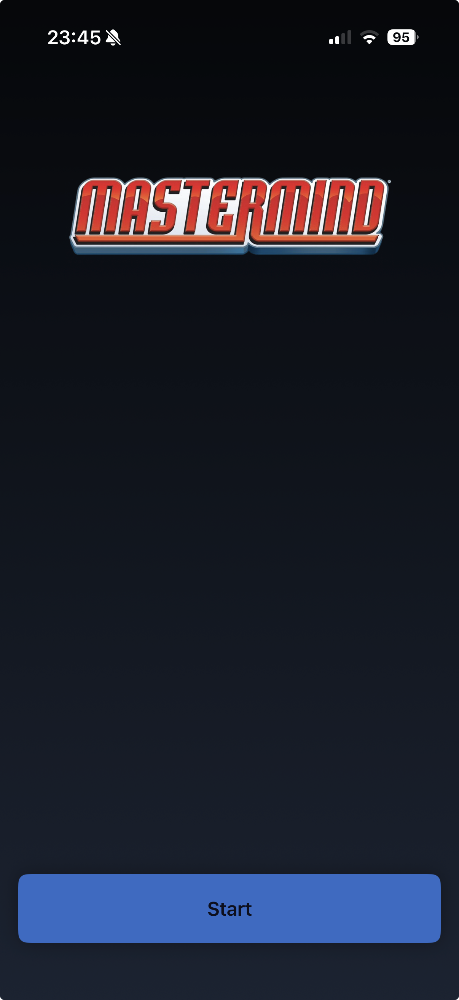
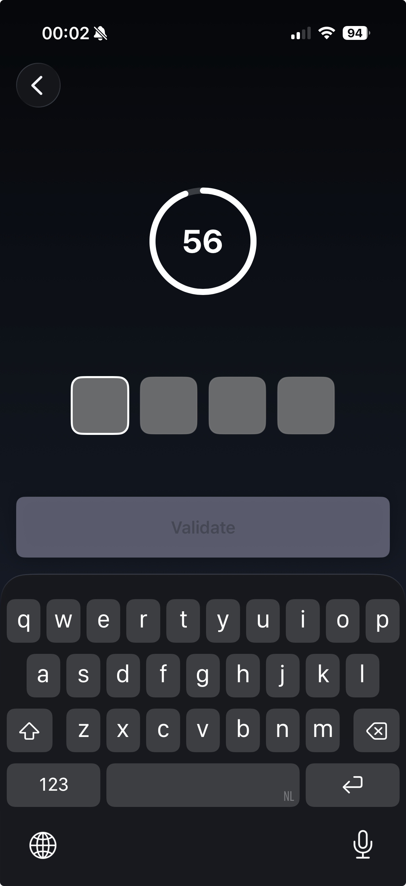
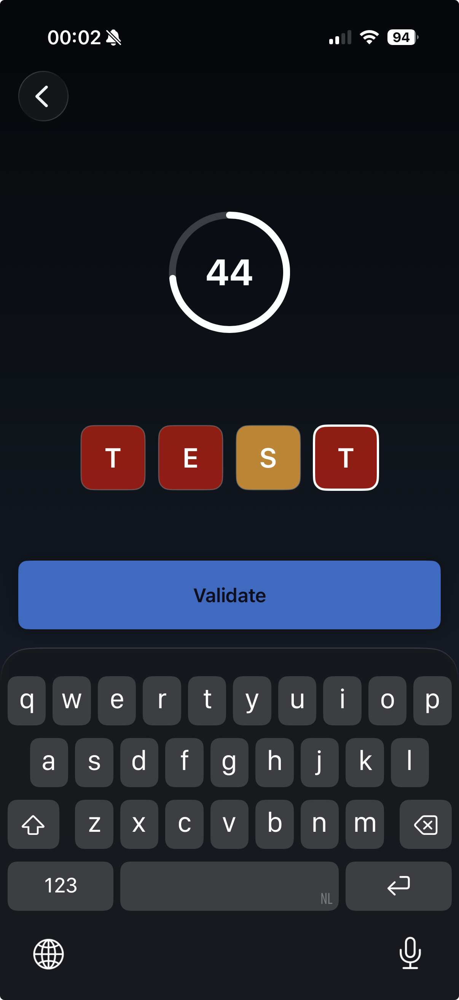
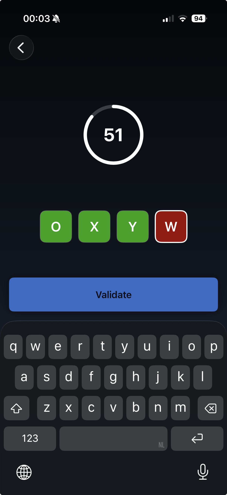
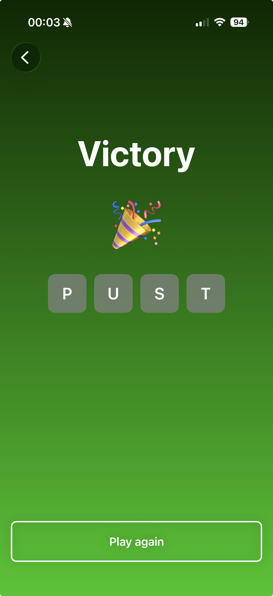
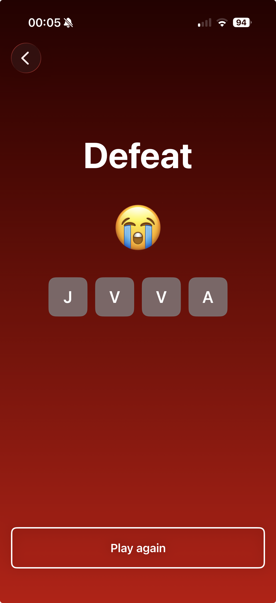

# Mastermind iOS

  
  
  

  
  
  

## Gameplay

- A random target sequence is generated at the start of each round
- Type characters into the input boxes to make your guess
- Tap **Validate** to check your guess against the solution
- Each character gets colored feedback:
  - **Correct** — right character, right position
  - **Contains** — right character, wrong position
  - **Not correct** — character not in the target
- Guess the full sequence before the countdown timer expires to win
- If time runs out, the correct solution is revealed

## Architecture

- **SwiftUI** - For all views
- **MVVM** 
- **Protocol-oriented services**
- **Factory pattern** — For dependency injection
- **Accessible** - VoiceOver support
- **Unit tested** — ViewModels and Services are tested using Swift Testing
